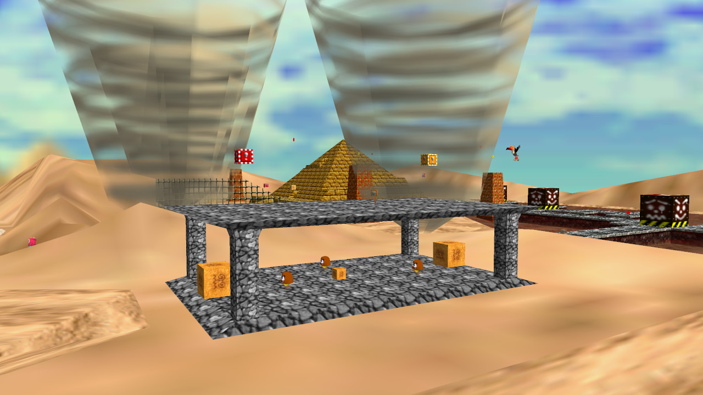

# Level Viewer 64
## For Super Mario 64, based on the [sm64 decomp](https://github.com/n64decomp/sm64) project

Level Viewer 64 is an unofficial fan project.  **No official assets are included in this project.**  As such, you will need your own legally dumped, personally owned Mario 64 ROM to use this program.  At this time, Level Viewer 64 only works with the US version of the ROM.

### Current Features
- Includes all levels from Super Mario 64 including Castle Grounds, Castle Inside, all 15 regular levels, all Bowser levels, cap switch levels, and more!
- All areas of a level are loaded simultaneously (unlike in the original game) and placed manually to remove all transitions between areas.
- Lighting works just as it does in the original game.
- All waterboxes and moving textures are correctly placed and displayed.
- Nearly all objects and models are correctly placed and sized.
- Flying first person camera with noclip.
- Title Menu with a small Easter egg.
- Level Select menu to quickly change levels.
- Options Menu with options to toggle textures, skybox, and wireframe as well as sliders for field-of-view and mouse sensitivity.
- Almost all graphics rendering is perfectly accurate to the original.  Even complicated things such as the sheets of transparent ice inside the igloo in Snowman's Land work properly.


### Requirements

- sm64 decomp repository clone
- Super Mario 64 ROM (US Version)
- Python3
- Python modules: pyglet, numpy, Pillow


### Installation

#### Use [sm64 decomp](https://github.com/n64decomp/sm64) to Parse the Textures

Follow the installation instructions on the [sm64 decomp](https://github.com/n64decomp/sm64) page: install all requirements, clone that repository, place a Super Mario 64 baserom (US Version) in the root directory, name it properly, and then run either `make` or `python3 extract_assets.py us` from that project to dump the texture assets from the US version of your Super Mario 64 ROM.

Note: running `make` will also recompile a byte-perfect ROM from the dumped textures and source code.  The recompilation is fairly time consuming.  If you only want to extract texures, just run the `extract_assets.py` script.

#### Run Level Viewer 64

Once textures have been dumped, git clone this project.  Then run `python3 setup.py`.  You will be prompted to enter the path to the source code directory with the dumped textures.  After entering the source code directory and `setup.py` completes, simply run `python3 main.py`.

Note: if you move the source code directory on your filesystem, you will have to run `setup.py` again and give it the new directory.  This is because `main.py` reads the textures directly out of the source code directory rather than copying them.


### Controls

```
W : Forward
S : Backward
A : Left
D : Right
Left Shift : Up
Spacebar : Down
Escape : Pause/Unpause
Right Click : Take Screenshot
Mouse Scroll : Change Movement Speed
```


### How It Works
Level Viewer 64 uses text parsing to read through the sm64 decomp source code.  The source code provides the level layout, geometry, animation, vertex, triangle, colour, texture coordinate, lighting, and object placement information as well as other renderer specific information.  All of this information is parsed and put into python dictionaries that are used at runtime.  The user must first dump the textures from the ROM using the [sm64 decomp](https://github.com/n64decomp/sm64) project.  These textures are then used by Level Viewer 64 during runtime.  Level Viewer 64 uses [pyglet](http://pyglet.org/) as an OpenGL wrapper and also for cross-platform windowing.


### Screenshots





### Known Issues

- Sizes of Piranha Plants and Koopas in Tiny Huge Island are wrong.
- The Ukiki model (in Tall Tall Mountain) doesn't display correctly.  This is caused by incomplete Geo parsing.
- Colours are slightly wrong in a few places leading to undesired graphics behavior like with the eyes of Boos and Penguins.  The Nintendo 64 colour combiner is surprisingly customizable while legacy OpenGL's is not.
- Some objects are missing.  Everything has been fully parsed out of the level scripts, so anything that is still missing is loaded in Mario 64 source code by object behavior functions.  These behaviors functions cannot be parsed and so would have to be manually read, understood, and reimplemented one by one.
- The red deathpit sand in Shifting Sand Land looks wrong?


### Known Nonissues

- Some objects are in strange places.  There are signs and Bob-ombs floating in the air and Goombas and 1-up mushrooms partially in the ground.  Level Viewer 64 accurately displays how objects are placed in the Mario 64 source code.  For all of these objects, their behavior functions in the original source code check collision and make the object fall to the ground.  So when a level is loaded, a sign might be floating in the air, but a frame later, it is in its normal spot on the ground.


### Future Work?

While I'm burned out on this project right now, here's a wishlist of things I didn't get to implement that could possibly arrive at some point in the future:

- pyglet 2.0 will remove support for legacy OpenGL and add support for modern OpenGL, including shaders.  This means that in 2.0 I can write shaders to perfectly recreate the Nintendo 64's colours and remove the remaining few rendering issues.  This should also provide a significant performance boost.
- Implement billboarding.  Some objects (such as trees and the body of Bob-ombs) are paper thin.  This is true in Super Mario 64 as well, but they always rotate so that they're facing the camera.  This is a cheat to cause a 3D effect.  Because of the way this project currently uses legacy OpenGL, billboarding would actually be much simpler to implement with a shader and hence in pyglet 2.0.
- Implement some missing objects?  Pokeys, Wiggler's body, coin rings, coin lines, the ferris wheel platforms in the Bowser levels, etc. are all spawned in the game by behavior functions rather than by typical object placement.  It would be nice to implement a few more of these behavior functions.  Some parts of levels look empty without all of the coins of coin rings and lines.
- Implement a font layout class.  The Mario 64 font letters are in textures that are dumped from the ROM.  A layout class would allow the use of the font directly from the game and remove the reliance on the fan-made font.
- Add parsing for the few unimplemented Geo graph nodes.
- Completely rewrite a couple of the parsers that are not well written.  Probably refactor the menus too.
- Make moving textures move.
- Make animations animate.


### Credits

Thanks to the [sm64 decomp](https://github.com/n64decomp/sm64) project for manually and arduously writing a byte-matching C decompilation of Mario 64.  Without that incredible feat, this project would not have been possible.

Thanks to the developers of [pyglet](http://pyglet.org/).  "pyglet is a powerful, yet easy to use Python library for developing games and other visually-rich applications on Windows, Mac OS X and Linux. It supports windowing, user interface event handling, Joysticks, OpenGL graphics, loading images and videos, and playing sounds and music. All of this with a friendly Pythonic API, that's simple to learn and doesn't get in your way."  pyglet was a great way for me to learn graphics programming and I also recommend it for fast prototyping of graphics applications.  The developers were also very helpful and answered a bunch of my questions.

Thanks to [aztecwarrior28](https://fontstruct.com/fontstructors/1606234/aztecwarrior28) for the [fan-made font](https://fontstruct.com/fontstructions/show/1770031/super-mario-64-8).

Thanks to Michelle for beta testing and for the programming discussions.